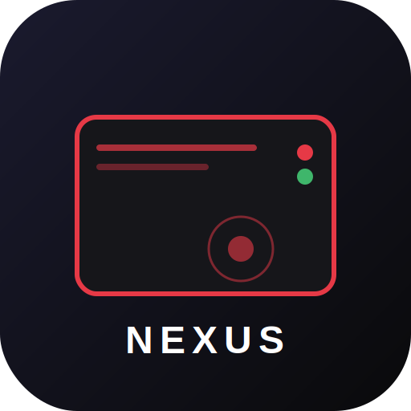

<p align="center">
  
</p>

<h1 align="center">NexusNAS</h1>

<p align="center">
  <strong>Serveur de stockage réseau privé, moderne et auto-hébergé</strong><br>
  <sub>Interface rouge/blanc/noir • Multi-utilisateurs • PWA installable • Zéro dépendance cloud</sub>
</p>

<p align="center">
  
  
  
  
  
</p>

---

## 📸 Aperçu

| Connexion | Dashboard | Explorateur |
|:---------:|:---------:|:-----------:|
| Écran d'authentification moderne | Statistiques en temps réel | Navigation par dossiers/grille |

---

## ✨ Fonctionnalités

### Stockage & Fichiers
- **Upload drag & drop** avec barre de progression
- **Explorateur de fichiers** en vue grille ou liste
- **Prévisualisation** intégrée (images, vidéos, audio, texte, PDF)
- **Recherche** instantanée dans tous vos fichiers
- **Favoris** et **corbeille** avec restauration
- **Dossiers** illimités avec navigation par fil d'Ariane
- **Téléchargement** individuel de fichiers
- **Quota** configurable par utilisateur (défaut : 50 Go)

### Sécurité & Utilisateurs
- **Authentification JWT** avec tokens 24h
- **Hashage bcrypt** des mots de passe
- **Multi-utilisateurs** avec rôles (admin / utilisateur)
- **Panneau admin** pour gérer les comptes
- **Isolation des données** par utilisateur

### Interface
- **Thème sombre** rouge / blanc / noir
- **Responsive** — smartphone, tablette, desktop
- **PWA installable** — ajoutez NexusNAS à votre écran d'accueil
- **Menu hamburger** sur mobile avec sidebar rétractable
- **Notifications toast** pour le feedback utilisateur
- **Menu contextuel** clic droit sur les fichiers

### Système
- **Monitoring temps réel** (CPU, RAM, disque)
- **Journal d'activité** des opérations fichiers
- **mDNS** — accessible via `nexusnas.local`
- **Service systemd** avec démarrage automatique
- **Service worker** pour cache offline des assets

---

## 🏗️ Architecture

```
nas-server/
├── app/
│   ├── __init__.py
│   ├── config.py            # Configuration (clés, chemins, quotas)
│   ├── database.py          # Engine SQLAlchemy async (aiosqlite)
│   ├── main.py              # Point d'entrée FastAPI
│   ├── models/
│   │   └── models.py        # User, FileEntry, ShareLink, ActivityLog
│   ├── routers/
│   │   ├── auth.py          # Login, register, profil, admin
│   │   ├── files.py         # CRUD fichiers, upload, download, corbeille
│   │   └── system.py        # Monitoring CPU/RAM/disque
│   └── utils/
│       ├── auth.py          # JWT, hashing, middleware OAuth2
│       └── files.py         # Catégorisation fichiers, thumbnails
├── static/
│   ├── css/style.css        # Thème complet (~1500 lignes)
│   ├── js/app.js            # SPA vanilla JS (~1300 lignes)
│   ├── img/                 # Icônes PWA (192px, 512px, SVG)
│   ├── manifest.json        # Manifest PWA
│   └── sw.js                # Service Worker
├── templates/
│   └── index.html           # Shell SPA
├── storage/                  # 📁 Fichiers utilisateurs (gitignored)
├── install.sh               # Installation automatique
├── start.sh                 # Lancement du serveur
├── nexusnas.service          # Unit systemd
└── requirements.txt
```

---

## 🚀 Installation

### Prérequis

- **Linux** (Ubuntu/Debian recommandé)
- **Python 3.10+**
- Accès réseau local (WiFi ou Ethernet)

### Installation rapide

```bash
# Cloner le dépôt
git clone https://github.com/Irkeedia/nas-nipogi.git
cd nas-nipogi

# Lancer l'installation automatique
chmod +x install.sh
./install.sh
```

Le script installe automatiquement :
- L'environnement virtuel Python
- Toutes les dépendances (FastAPI, SQLAlchemy, Pillow…)
- Les dossiers de stockage

### Lancement

```bash
# Démarrage manuel
./start.sh

# Ou en service systemd (démarrage auto au boot)
sudo cp nexusnas.service /etc/systemd/system/
sudo systemctl daemon-reload
sudo systemctl enable --now nexusnas.service
```

### Accès mDNS (optionnel)

Pour accéder au NAS via `nexusnas.local` au lieu de l'IP :

```bash
sudo apt install avahi-daemon
sudo hostnamectl set-hostname nexusnas
sudo systemctl enable --now avahi-daemon
```

---

## 📱 Utilisation

### Première connexion

1. Ouvrez `http://<IP_DU_SERVEUR>:8888` ou `http://nexusnas.local:8888`
2. **Créez un compte** — le premier utilisateur est automatiquement **admin**
3. C'est prêt ! Uploadez vos fichiers.

### Installer comme application (PWA)

| Plateforme | Comment faire |
|:-----------|:-------------|
| **Android** | Chrome → menu ⋮ → *Ajouter à l'écran d'accueil* |
| **iOS** | Safari → bouton partage → *Sur l'écran d'accueil* |
| **PC/Mac** | Chrome/Edge → icône ⊕ dans la barre d'adresse |

### API REST

Tous les endpoints sont sous `/api/` :

| Méthode | Endpoint | Description |
|:--------|:---------|:------------|
| `POST` | `/api/auth/login` | Connexion (OAuth2 form) |
| `POST` | `/api/auth/register` | Inscription |
| `GET` | `/api/auth/me` | Profil utilisateur |
| `GET` | `/api/files/` | Lister les fichiers |
| `POST` | `/api/files/upload` | Upload de fichier |
| `GET` | `/api/files/download/{id}` | Télécharger un fichier |
| `POST` | `/api/files/folder` | Créer un dossier |
| `DELETE` | `/api/files/{id}` | Supprimer / mettre en corbeille |
| `GET` | `/api/files/search?q=...` | Recherche |
| `GET` | `/api/files/favorites` | Fichiers favoris |
| `GET` | `/api/files/trash` | Corbeille |
| `GET` | `/api/system/info` | Infos système (admin) |

---

## ⚙️ Configuration

Les paramètres sont dans [`app/config.py`](app/config.py) :

| Variable | Défaut | Description |
|:---------|:-------|:------------|
| `SECRET_KEY` | `nexusnas-super-secret...` | Clé JWT — **à changer en production** |
| `ACCESS_TOKEN_EXPIRE_MINUTES` | `1440` (24h) | Durée de validité du token |
| `MAX_UPLOAD_SIZE` | `10 Go` | Taille max par upload |
| `PORT` | `8888` | Port du serveur |
| `STORAGE_PATH` | `./storage` | Répertoire de stockage |

---

## 🔧 Stack technique

| Composant | Technologie |
|:----------|:------------|
| **Backend** | FastAPI + Uvicorn |
| **Base de données** | SQLite (async via aiosqlite) |
| **ORM** | SQLAlchemy 2.0 (async) |
| **Auth** | JWT (python-jose) + bcrypt |
| **Frontend** | Vanilla JS (SPA) + CSS custom |
| **Images** | Pillow (thumbnails) |
| **Monitoring** | psutil |
| **mDNS** | Avahi |
| **PWA** | Service Worker + Web App Manifest |

---

## 🤝 Contribuer

Les contributions sont les bienvenues !

```bash
# Fork → Clone → Branch
git checkout -b feature/ma-fonctionnalite

# Développez puis committez
git commit -m "feat: description de la fonctionnalité"

# Push et ouvrez une Pull Request
git push origin feature/ma-fonctionnalite
```

---

## 📄 Licence

Ce projet est sous licence **MIT**. Voir le fichier `LICENSE` pour plus de détails.

---

<p align="center">
  <sub>Fait avec ❤️ pour le self-hosting</sub><br>
  <sub><strong>NexusNAS</strong> — Votre stockage, vos règles.</sub>
</p>
